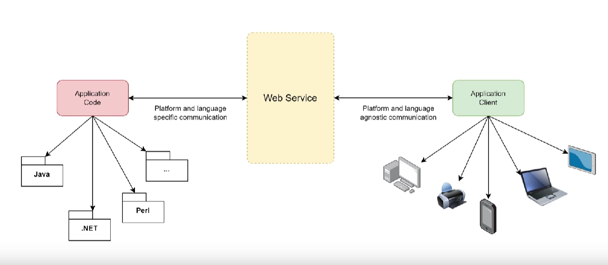

# web servisleri

<figure><figcaption></figcaption></figure>

Web servisleri birden fazla dili bir arada kullanma fırsatı bizlere sunar. Java, .NET, .. vb gibi dillerde yazılan kodların daha sonrasında web servisleri vasıtası ile sunucu tarafına aktarılması durumunu buradaki görüntüde görmekteyiz. Yani köprü görevi görücek.

<figure><figcaption></figcaption></figure>

Web servislerinin TCP/IP katmanları ile benzerlik gösterdiğini söyleyebiliriz. Network(Ağ) katmanı TCP/IP modeli ile tamamen aynıdır.

&#x20;Daha sonra ağ katmanının üzerinde taşıma katmanı olur (Transport) , taşıma katmanı çeşitli teknolojileri içeririr bunlar; TCP, HTTP,SMTP ve JABBER gibi.&#x20;

İletişimin sağlıklı bir şekilde gerçekleştirilebilmesi için Transport katmanından sonra packaging(Paketleme) katmanı gelir. Burada yaygın olarak kullanılan dosya formatları XML ve JASON dosya formatları olacaktır. Aynı zamanda web servisleri dediğimizde XML akla gelen ilk paketleme dosya formatı olur.

Paketleme katmanından sonra Tanımlama(Description) katmanı ele alınır.WSDL adı verilen bir yapı kullanılır.Web servislerinin hangi methodları içerdiği, hangi parametreleri aldığı, hangi paketleme protokollerini destekleyeceğinin bilgisi burada verilir.

Discover dediğimiz katman tanımlamadan sonra yapılır ve burada web servislerinin keşfinin yapılması sağlanır.UDDI en yaygın keşif mekanizmalarından birisidir.

<figure><figcaption></figcaption></figure>

Özetlemek gerekirse; Discover katmanında UDDI adı verilen evrensel bir keşif hizmetinin bulunduğu,Description katmanında WSDL , WADL adı verilen yapı sayesinde web servislerinin protokolleri hakkında bilgi verir. Packaging katmanında, Serialization , Marshalling gibi yapılar kullanılır.Transport katmanında TCP,HTTP,Jabber gibi protokollerden bahsedilir. Network katmanında iste TCP/IP protokololleriyle doğrudan ilişki kurulduğunu söylemekteyiz.&#x20;

## Web Servis Türleri

* SOAP: Nesneye basit bir şekilde erişim sağlar. Yaygın bir şekilde kullanılan web servis türlerinden biridir. HTTP protokolü üzerinden etkileşim sağlanır. Veri formatı olarak XML kullanır. WSDL kullanarak servislerin tanımlanmasını ve belgelenmesini gerçekleştirir. Belirli bir servis methodunu çağırmak için kullanılır.
* REST: HTTP protokolünü odağa alır.XML desteğinin yanında JASON desteği de var Hatta genel olarak JASON formatının kullanıldığı yerdir. Kurallı ve daha düzenli ilerler.Kaynak odaklı bir mimari vardır.Her şeykaynaklar ile temsil edilir. Kaynaklara giderken HTTP wordleri kullanılır bunlar; POST,GET,PUT,DELETE gibi.
* GraphQL: HTTP prokolü üzerinden JASON formatını kullanarak gerçekleştirilen bir teknoloji diyebiliriz. Burada sorgu tabanlı bir yaklaşım söz konusudur. İstemciler sunucudan spesifik veriler talep edebiliyorlar. Bu da birden fazla api'ın birleştirilerek tek bir sunucu seti üretilmesi hem de biraz daha trafiğin ya da api yükünün, servis yükünün azaltıldığı bir yapı olarak düşünülebilir.
* gRPC:  Uzak proseslerin çağrılabildiği modern bir frameworktür. HTTP/2 standartlarını kullanan bir yapı kullanır.
